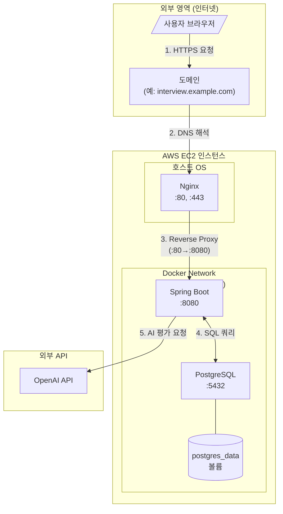
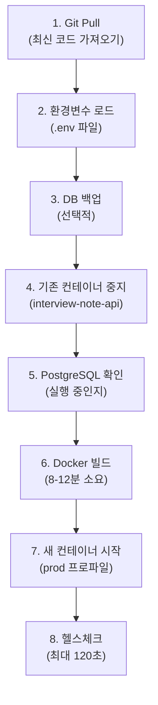
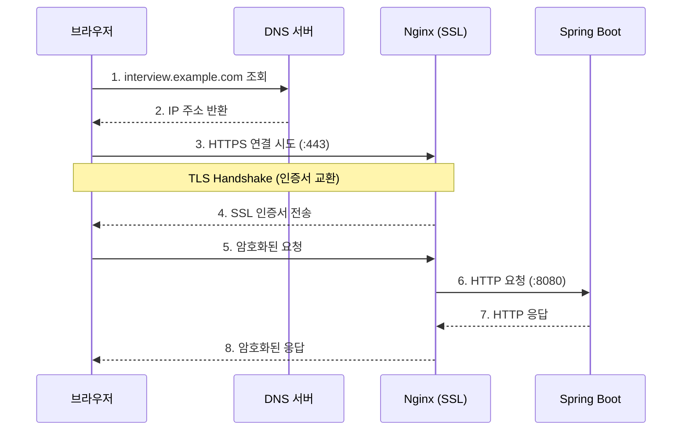
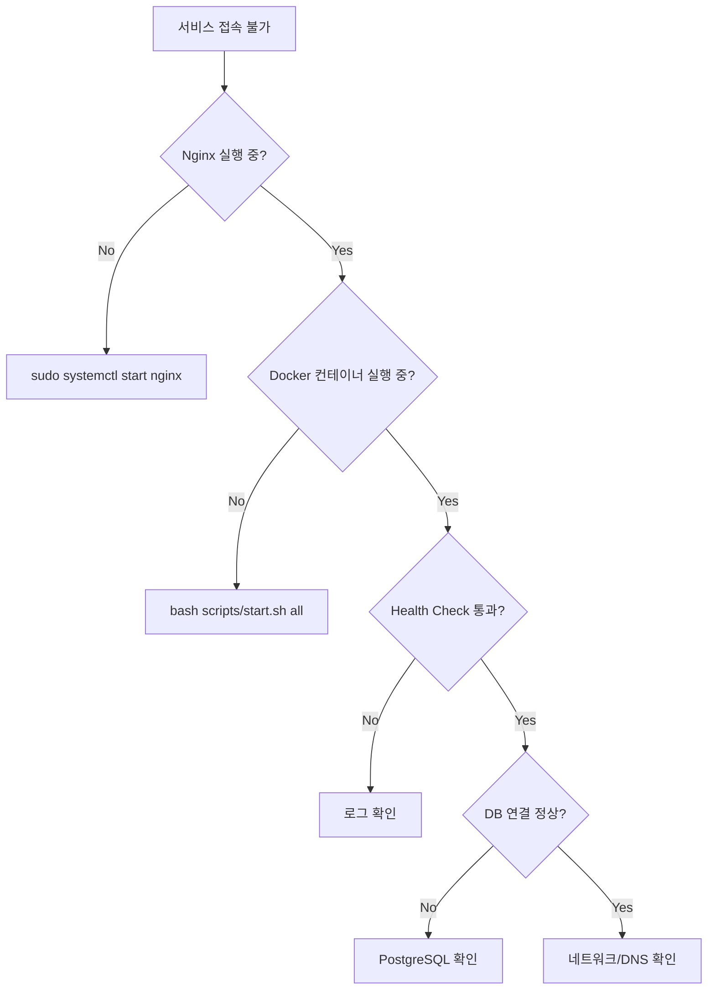

# Infrastructure Documentation

**작성일**: 2026-06-21
**프로젝트**: Interview Note API
**대상 독자**: 인프라 경험이 부족한 백엔드 개발자

---

## 목차

1. [Architecture Overview](#1-architecture-overview)
2. [AWS EC2 Environment](#2-aws-ec2-environment)
3. [Docker Configuration](#3-docker-configuration)
4. [Deployment Workflow](#4-deployment-workflow)
5. [Nginx Reverse Proxy](#5-nginx-reverse-proxy)
6. [HTTPS/SSL Structure](#6-httpsssl-structure)
7. [Troubleshooting Guide](#7-troubleshooting-guide)
8. [Improvement Plan](#8-improvement-plan)
9. [Quick Reference](#9-quick-reference)

---

## 1. Architecture Overview

### 1.1 사용자 요청 흐름



### 1.2 각 컴포넌트 역할

| 컴포넌트 | 역할 | 설명 |
|---------|------|------|
| **Domain** | 도메인 이름 | 사용자가 기억하기 쉬운 주소 제공 |
| **Nginx** | Reverse Proxy | 외부 요청을 내부 컨테이너로 전달, SSL 종료, 로드밸런싱 |
| **Spring Boot** | 애플리케이션 | 비즈니스 로직 처리, REST API 제공 |
| **PostgreSQL** | 데이터베이스 | 사용자, 질문, 답변, 피드백 데이터 저장 |
| **OpenAI API** | AI 서비스 | 면접 답변 평가 및 피드백 생성 |

### 1.3 포트 흐름

```
인터넷 → :443 (HTTPS) → Nginx → :8080 → Spring Boot
                                    ↓
인터넷 → :80 (HTTP)  → Nginx     PostgreSQL (:5432, 내부 전용)
         (→ :443 리다이렉트)
```

### 1.4 외부/내부 영역 구분

| 영역 | 포트 | 접근 가능 |
|------|------|----------|
| **외부 공개** | 80, 443 | 인터넷에서 접근 가능 |
| **내부 전용** | 8080, 5432 | Docker 네트워크 내부에서만 접근 |
| **관리용** | 22 (SSH) | 허용된 IP에서만 접근 (보안 그룹) |

---

## 2. AWS EC2 Environment

### 2.1 현재 구성 (확인 필요)

> ⚠️ EC2 직접 접속 불가로 일부 항목은 스크립트 분석을 통해 추론한 내용입니다.

| 항목 | 예상 값 | 확인 필요 |
|------|---------|----------|
| **OS** | Amazon Linux 2023 | ✅ |
| **인스턴스 타입** | t3.micro 또는 t3.small | ✅ |
| **스토리지** | EBS gp3 | ✅ |
| **리전** | ap-northeast-2 (서울) | ✅ |

### 2.2 권장 보안 그룹 설정

```
인바운드 규칙:
┌────────┬──────────┬─────────────────┬────────────────────────┐
│ 타입   │ 포트     │ 소스            │ 설명                   │
├────────┼──────────┼─────────────────┼────────────────────────┤
│ SSH    │ 22       │ 내 IP          │ 서버 관리용            │
│ HTTP   │ 80       │ 0.0.0.0/0      │ 웹 접근 (HTTPS 리다이렉트) │
│ HTTPS  │ 443      │ 0.0.0.0/0      │ 웹 접근               │
└────────┴──────────┴─────────────────┴────────────────────────┘

아웃바운드 규칙:
┌────────┬──────────┬─────────────────┬────────────────────────┐
│ 타입   │ 포트     │ 대상            │ 설명                   │
├────────┼──────────┼─────────────────┼────────────────────────┤
│ All    │ All      │ 0.0.0.0/0      │ 인터넷 접근 (OpenAI 등) │
└────────┴──────────┴─────────────────┴────────────────────────┘
```

### 2.3 디렉토리 구조 (예상)

```
/home/ec2-user/
└── apps/
    └── interview-note-api/
        ├── .env                    # 환경변수 (OPENAI_API_KEY 등)
        ├── docker-compose.yml
        ├── Dockerfile
        ├── scripts/
        │   ├── deploy.sh
        │   ├── start.sh
        │   ├── stop.sh
        │   └── ...
        └── src/
            └── ...
```

### 2.4 운영 시 주의사항

1. **SSH 접속 제한**: 보안 그룹에서 특정 IP만 허용
2. **디스크 용량 모니터링**: Docker 이미지/로그로 인한 용량 부족 주의
3. **인스턴스 재부팅**: Docker 서비스가 자동 시작되도록 설정 필요
4. **백업**: EBS 스냅샷 또는 PostgreSQL 덤프 주기적 수행

---

## 3. Docker Configuration

### 3.1 Dockerfile 분석

프로젝트는 **Multi-stage 빌드**를 사용하여 이미지 크기를 최적화합니다.

#### Stage 1: 빌드 단계 (Builder)

```dockerfile
FROM gradle:8.5-jdk21 AS builder
WORKDIR /app

# 의존성 캐싱 (build.gradle이 변경되지 않으면 재사용)
COPY build.gradle.kts settings.gradle.kts ./
COPY gradle ./gradle
RUN gradle dependencies --no-daemon || true

# 소스 코드 복사 및 빌드
COPY src ./src
RUN gradle build -x test --no-daemon
```

**왜 이렇게 하나요?**
- 의존성 다운로드 레이어를 분리하여 빌드 캐시 효율 증가
- 소스 코드만 변경 시 의존성 다운로드 스킵 (빌드 시간 단축)
- `-x test`: 테스트 스킵 (CI/CD에서 별도 실행)

#### Stage 2: 실행 단계 (Runtime)

```dockerfile
FROM eclipse-temurin:21-jre-alpine
WORKDIR /app

# 타임존 설정
RUN apk add --no-cache tzdata
ENV TZ=Asia/Seoul

# 보안: Non-root 유저로 실행
RUN addgroup -S spring && adduser -S spring -G spring
USER spring:spring

# JAR 파일만 복사 (빌드 도구 제외)
COPY --from=builder /app/build/libs/*.jar app.jar

# 포트 노출 및 헬스체크
EXPOSE 8080
HEALTHCHECK --interval=30s --timeout=3s --start-period=40s --retries=3 \
  CMD wget --no-verbose --tries=1 --spider http://localhost:8080/actuator/health/liveness || exit 1

# JVM 최적화 옵션으로 실행
ENTRYPOINT ["java", \
    "-Djava.security.egd=file:/dev/./urandom", \
    "-Dspring.profiles.active=${SPRING_PROFILES_ACTIVE:-prod}", \
    "-XX:+UseContainerSupport", \
    "-XX:MaxRAMPercentage=75.0", \
    "-jar", "app.jar"]
```

**JVM 옵션 설명:**

| 옵션 | 설명 |
|------|------|
| `-Djava.security.egd=file:/dev/./urandom` | 난수 생성 속도 개선 (시작 시간 단축) |
| `-XX:+UseContainerSupport` | 컨테이너 메모리 제한 인식 |
| `-XX:MaxRAMPercentage=75.0` | 컨테이너 메모리의 75%를 힙으로 사용 |

**이미지 크기:**
- 빌드 스테이지: ~800MB (빌드 후 삭제)
- 최종 이미지: **~180MB** (JRE + JAR만 포함)

### 3.2 docker-compose.yml 분석

```yaml
services:
  # 데이터베이스 서비스
  postgres:
    image: postgres:15-alpine
    container_name: interview-postgres
    environment:
      POSTGRES_DB: interviewdb
      POSTGRES_USER: interviewuser
      POSTGRES_PASSWORD: interviewpass
    ports:
      - "5432:5432"
    volumes:
      - postgres_data:/var/lib/postgresql/data    # 데이터 영속성
    healthcheck:
      test: ["CMD-SHELL", "pg_isready -U interviewuser -d interviewdb"]
      interval: 10s
      timeout: 5s
      retries: 5
    networks:
      - interview-network

  # 애플리케이션 서비스
  app:
    build: .
    container_name: interview-note-api
    depends_on:
      postgres:
        condition: service_healthy    # PostgreSQL 준비될 때까지 대기
    ports:
      - "8080:8080"
    environment:
      SPRING_PROFILES_ACTIVE: prod
      OPENAI_API_KEY: ${OPENAI_API_KEY}    # .env에서 주입
      SPRING_DATASOURCE_URL: jdbc:postgresql://postgres:5432/interviewdb
      SPRING_DATASOURCE_USERNAME: interviewuser
      SPRING_DATASOURCE_PASSWORD: interviewpass
    restart: unless-stopped    # 크래시 시 자동 재시작
    healthcheck:
      test: ["CMD", "wget", "--no-verbose", "--tries=1", "--spider",
             "http://localhost:8080/actuator/health/liveness"]
      interval: 30s
      timeout: 3s
      start_period: 40s
      retries: 3
    networks:
      - interview-network

networks:
  interview-network:
    driver: bridge

volumes:
  postgres_data:    # 이름 있는 볼륨 (Docker가 관리)
```

### 3.3 Q&A: Docker 구성 이해하기

#### Q: Spring Boot 앱은 어떤 방식으로 Docker에서 실행되나요?

**A:** 다음 순서로 실행됩니다:

1. `docker-compose up --build` 실행
2. Dockerfile의 빌드 스테이지에서 JAR 생성
3. 런타임 스테이지에서 최소 이미지 생성
4. PostgreSQL 컨테이너가 먼저 시작되고 헬스체크 통과
5. Spring Boot 컨테이너가 시작되어 `prod` 프로파일로 실행

#### Q: Docker 컨테이너 내부에서 어떤 프로세스가 실행되나요?

**A:** 각 컨테이너당 하나의 메인 프로세스:

| 컨테이너 | 프로세스 | PID 1 |
|---------|---------|-------|
| interview-postgres | postgres (데이터베이스 데몬) | postgres |
| interview-note-api | java -jar app.jar | java |

#### Q: 데이터는 어디에 저장되나요?

**A:**
- **PostgreSQL 데이터**: `postgres_data` 볼륨 → `/var/lib/docker/volumes/...` (호스트)
- **애플리케이션 로그**: 컨테이너 stdout (docker logs로 조회)
- **업로드 파일**: 없음 (현재 파일 업로드 기능 없음)

#### Q: 컨테이너 재시작 시 영향은 무엇인가요?

**A:**

| 시나리오 | 데이터 | 서비스 |
|---------|--------|--------|
| App 컨테이너 재시작 | 유지 (DB 볼륨) | 1-2분 다운타임 |
| PostgreSQL 재시작 | 유지 (볼륨) | App 연결 일시 끊김 (자동 재연결) |
| `docker-compose down` | 유지 (볼륨) | 전체 서비스 중단 |
| `docker-compose down -v` | **삭제** | 전체 서비스 + 데이터 삭제 |

### 3.4 네트워크 구성

```
┌─────────────────────────────────────────────────────────────┐
│                   Docker Bridge Network                      │
│                   (interview-network)                        │
│                                                              │
│  ┌─────────────────┐         ┌─────────────────┐            │
│  │ interview-note- │         │ interview-      │            │
│  │ api             │ ──DNS── │ postgres        │            │
│  │ :8080           │         │ :5432           │            │
│  └────────┬────────┘         └─────────────────┘            │
│           │                                                  │
└───────────┼──────────────────────────────────────────────────┘
            │
     ┌──────┴──────┐
     │  :8080      │ (포트 매핑)
     │  호스트     │
     └─────────────┘
```

**서비스 간 통신:**
- App → PostgreSQL: `postgres:5432` (DNS 해석)
- 외부 → App: `localhost:8080` (포트 매핑)

### 3.5 환경변수 전달 방식

```bash
# .env 파일 (프로젝트 루트)
OPENAI_API_KEY=sk-xxxxxxxxxxxx

# docker-compose.yml에서 참조
environment:
  OPENAI_API_KEY: ${OPENAI_API_KEY}
```

**보안 주의:**
- `.env` 파일은 `.gitignore`에 포함 (Git에 커밋 금지)
- `.dockerignore`에도 포함 (이미지에 포함 금지)

---

## 4. Deployment Workflow

### 4.1 deploy.sh 8단계 프로세스

```bash
bash scripts/deploy.sh
```



#### 각 단계 상세

| 단계 | 명령어 | 소요 시간 | 설명 |
|------|--------|----------|------|
| 1 | `git pull origin main` | 1-10초 | 원격 저장소에서 최신 코드 |
| 2 | `source .env` | 즉시 | OPENAI_API_KEY 등 로드 |
| 3 | 외부 스크립트 | 선택적 | PostgreSQL pg_dump |
| 4 | `docker stop/rm` | 1-5초 | 기존 앱 컨테이너 정리 |
| 5 | `docker start` | 0-10초 | PostgreSQL 미실행 시 시작 |
| 6 | `docker build` | **8-12분** (t3.micro) | Gradle 빌드 + 이미지 생성 |
| 7 | `docker run` | 1-5초 | 새 컨테이너 시작 |
| 8 | `curl /actuator/health` | 40-120초 | 앱 준비 완료 확인 |

### 4.2 빌드 과정

```bash
# 전체 빌드 (느림, 약 8-12분)
docker build -t interview-note-api:latest .

# 캐시된 빌드 (빠름, 1-2분)
# build.gradle.kts가 변경되지 않은 경우
```

### 4.3 컨테이너 교체 방식

```bash
# 1. 기존 컨테이너 중지 (Graceful Shutdown)
docker stop interview-note-api

# 2. 컨테이너 삭제
docker rm interview-note-api

# 3. 새 컨테이너 시작
docker run -d \
  --name interview-note-api \
  --network interview-note-api_interview-network \
  -p 8080:8080 \
  -e SPRING_PROFILES_ACTIVE=prod \
  -e OPENAI_API_KEY=$OPENAI_API_KEY \
  -e SPRING_DATASOURCE_URL=jdbc:postgresql://interview-postgres:5432/interviewdb \
  -e SPRING_DATASOURCE_USERNAME=interviewuser \
  -e SPRING_DATASOURCE_PASSWORD=interviewpass \
  --restart unless-stopped \
  interview-note-api:latest
```

### 4.4 무중단 배포 여부

| 항목 | 현재 상태 |
|------|----------|
| **무중단 배포** | ❌ 미지원 |
| **예상 다운타임** | 1-2분 (빌드 후 컨테이너 교체) |
| **롤백 지원** | ⚠️ 수동 (이전 이미지 태그 필요) |

**무중단 배포 구현 방법 (향후 개선):**
1. Blue-Green 배포 (2개 컨테이너 번갈아 사용)
2. Rolling Update (Docker Swarm/Kubernetes)
3. AWS ELB + Auto Scaling Group

### 4.5 기타 배포 스크립트

| 스크립트 | 용도 | 명령어 |
|---------|------|--------|
| `start.sh` | 중지된 컨테이너 시작 | `bash scripts/start.sh [all]` |
| `stop.sh` | 실행 중인 컨테이너 중지 | `bash scripts/stop.sh [all]` |
| `restart.sh` | 빠른 재시작 (빌드 없음) | `bash scripts/restart.sh` |
| `status.sh` | 시스템 상태 확인 | `bash scripts/status.sh` |
| `logs.sh` | 로그 조회 | `bash scripts/logs.sh [app\|postgres\|nginx]` |

---

## 5. Nginx Reverse Proxy

### 5.1 왜 Spring Boot 앞에 Nginx를 두나요?

```
                    Nginx의 역할
                         │
    ┌────────────────────┼────────────────────┐
    │                    │                    │
    ▼                    ▼                    ▼
SSL 종료           정적 파일 제공        리버스 프록시
(HTTPS 처리)       (CSS, JS, 이미지)    (요청 전달)
    │                    │                    │
    │                    │                    │
    ▼                    ▼                    ▼
암호화/복호화는     Spring Boot가        로드 밸런싱
Nginx에서 처리      동적 요청만 처리     (향후 확장)
```

**장점:**
1. **SSL 처리 분리**: Spring Boot는 HTTP만 처리 (간단)
2. **정적 파일 효율**: Nginx가 정적 파일 직접 제공 (빠름)
3. **보안**: 내부 포트(8080) 외부 노출 방지
4. **버퍼링**: 대용량 요청/응답 효율적 처리
5. **확장성**: 다중 인스턴스 로드 밸런싱 가능

### 5.2 Nginx 설정 파일

**파일 위치:** `/etc/nginx/conf.d/interview-note-api.conf` (EC2)
**프로젝트 내:** `/nginx-sse-config.conf`

```nginx
server {
    listen 80;
    server_name your-domain.com;  # 실제 도메인으로 변경

    # 일반 요청: 버퍼링 O
    location / {
        proxy_pass http://localhost:8080;
        proxy_set_header Host $host;
        proxy_set_header X-Real-IP $remote_addr;
        proxy_set_header X-Forwarded-For $proxy_add_x_forwarded_for;
        proxy_set_header X-Forwarded-Proto $scheme;
    }

    # SSE (Server-Sent Events): 버퍼링 X
    location /mock-interviews {
        proxy_pass http://localhost:8080;

        # SSE 필수 설정
        proxy_buffering off;           # 버퍼링 비활성화 (중요!)
        proxy_cache off;               # 캐시 비활성화
        proxy_http_version 1.1;        # HTTP/1.1 필수 (Keep-Alive)
        proxy_set_header Connection '';
        chunked_transfer_encoding off;

        # 긴 연결 유지 (1시간)
        proxy_read_timeout 3600s;
        proxy_send_timeout 3600s;
        proxy_connect_timeout 60s;

        proxy_set_header X-Accel-Buffering no;
        proxy_set_header Host $host;
        proxy_set_header X-Real-IP $remote_addr;
        proxy_set_header X-Forwarded-For $proxy_add_x_forwarded_for;
        proxy_set_header X-Forwarded-Proto $scheme;
    }
}
```

### 5.3 SSE (Server-Sent Events) 특별 설정

AI 채팅 면접 기능(`/mock-interviews`)은 실시간 스트리밍이 필요합니다.

**문제:**
Nginx는 기본적으로 응답을 버퍼링하여 한 번에 전송합니다. 이는 SSE에서 문제가 됩니다.

**해결:**
```nginx
proxy_buffering off;           # 버퍼링 비활성화
proxy_set_header X-Accel-Buffering no;  # 명시적 비활성화
```

**SSE vs WebSocket:**

| 특성 | SSE | WebSocket |
|------|-----|-----------|
| 방향 | 서버 → 클라이언트 (단방향) | 양방향 |
| 프로토콜 | HTTP | WS/WSS |
| 재연결 | 자동 | 수동 구현 필요 |
| 용도 | 실시간 피드, 알림 | 채팅, 게임 |

### 5.4 Header 전달 설정

```nginx
proxy_set_header Host $host;
proxy_set_header X-Real-IP $remote_addr;
proxy_set_header X-Forwarded-For $proxy_add_x_forwarded_for;
proxy_set_header X-Forwarded-Proto $scheme;
```

| 헤더 | 용도 |
|------|------|
| `Host` | 원본 호스트 이름 전달 |
| `X-Real-IP` | 실제 클라이언트 IP (Rate Limiting에 사용) |
| `X-Forwarded-For` | 프록시 체인의 모든 IP |
| `X-Forwarded-Proto` | 원본 프로토콜 (http/https) |

---

## 6. HTTPS/SSL Structure

### 6.1 현재 상태 (확인 필요)

| 항목 | 예상 값 | 확인 필요 |
|------|---------|----------|
| **SSL 인증서** | Let's Encrypt | ✅ |
| **인증서 관리** | Certbot | ✅ |
| **자동 갱신** | Cron 또는 systemd timer | ✅ |
| **인증서 위치** | `/etc/letsencrypt/live/domain/` | ✅ |

### 6.2 HTTPS 요청 흐름



### 6.3 Let's Encrypt 설정 (권장)

#### 초기 설치

```bash
# Amazon Linux 2023
sudo dnf install -y certbot python3-certbot-nginx

# 인증서 발급
sudo certbot --nginx -d interview.example.com

# 자동 갱신 테스트
sudo certbot renew --dry-run
```

#### Nginx SSL 설정 (자동 추가됨)

```nginx
server {
    listen 443 ssl;
    server_name interview.example.com;

    ssl_certificate /etc/letsencrypt/live/interview.example.com/fullchain.pem;
    ssl_certificate_key /etc/letsencrypt/live/interview.example.com/privkey.pem;
    include /etc/letsencrypt/options-ssl-nginx.conf;
    ssl_dhparam /etc/letsencrypt/ssl-dhparams.pem;

    # ... 기존 location 블록
}

server {
    listen 80;
    server_name interview.example.com;
    return 301 https://$server_name$request_uri;  # HTTP → HTTPS 리다이렉트
}
```

### 6.4 인증서 갱신

Let's Encrypt 인증서는 90일마다 만료됩니다.

```bash
# 수동 갱신
sudo certbot renew

# 자동 갱신 (cron)
# /etc/cron.d/certbot 자동 생성됨
0 0,12 * * * root certbot renew --quiet
```

---

## 7. Troubleshooting Guide

### 7.1 장애 발생 시 확인 순서



### 7.2 로그 확인 방법

```bash
# 애플리케이션 로그 (실시간)
bash scripts/logs.sh app follow

# 에러만 필터링
bash scripts/logs.sh error

# PostgreSQL 로그
bash scripts/logs.sh postgres

# Nginx 로그
bash scripts/logs.sh nginx
bash scripts/logs.sh nginx-error

# Docker 로그 직접 조회
docker logs -f interview-note-api --tail 100
docker logs -f interview-postgres --tail 50
```

### 7.3 Docker 장애 대응

#### 컨테이너가 시작되지 않을 때

```bash
# 1. 컨테이너 상태 확인
docker ps -a

# 2. 종료된 컨테이너 로그 확인
docker logs interview-note-api

# 3. 컨테이너 재시작
bash scripts/restart.sh

# 4. 전체 재배포 (문제 지속 시)
bash scripts/deploy.sh
```

#### OOM (메모리 부족)

```bash
# 메모리 사용량 확인
docker stats

# 컨테이너 메모리 제한 확인
docker inspect interview-note-api | grep -i memory
```

### 7.4 서버 재시작 방법

```bash
# 애플리케이션만 재시작 (빠름, 빌드 없음)
bash scripts/restart.sh

# 전체 재배포 (새 코드 반영)
bash scripts/deploy.sh

# EC2 재부팅 후 서비스 시작
bash scripts/start.sh all
sudo systemctl start nginx
```

### 7.5 배포 롤백 방법

```bash
# 1. 이전 이미지 확인
docker images interview-note-api

# 2. 현재 컨테이너 중지
docker stop interview-note-api
docker rm interview-note-api

# 3. 이전 버전으로 롤백 (태그가 있는 경우)
docker run -d \
  --name interview-note-api \
  # ... (기존 옵션) \
  interview-note-api:previous

# ⚠️ 현재는 태그 관리 없음 - Git으로 코드 롤백 후 재배포 권장
git checkout <이전_커밋>
bash scripts/deploy.sh
```

### 7.6 디스크 부족 대응

```bash
# 디스크 사용량 확인
df -h

# Docker 정리 (미사용 이미지, 컨테이너, 볼륨)
docker system prune -a

# 오래된 로그 정리
sudo truncate -s 0 /var/log/nginx/access.log
sudo truncate -s 0 /var/log/nginx/error.log

# Docker 로그 크기 제한 (daemon.json 설정 권장)
```

### 7.7 인증서 만료 대응

```bash
# 인증서 만료일 확인
sudo certbot certificates

# 수동 갱신
sudo certbot renew

# Nginx 재시작
sudo systemctl reload nginx

# 갱신 실패 시 재발급
sudo certbot --nginx -d interview.example.com --force-renewal
```

---

## 8. Improvement Plan

### 8.1 High Priority (즉시 개선 권장)

| 항목 | 현재 상태 | 개선 방안 | 효과 |
|------|----------|----------|------|
| **리소스 제한** | 미설정 | docker-compose에 limits 추가 | OOM 방지, 안정성 향상 |
| **로그 로테이션** | 미설정 | Docker logging driver 설정 | 디스크 부족 방지 |
| **시크릿 관리** | .env 파일 | AWS Secrets Manager | 보안 강화 |

#### 리소스 제한 설정 예시

```yaml
# docker-compose.yml
services:
  app:
    deploy:
      resources:
        limits:
          cpus: '1.0'
          memory: 1G
        reservations:
          cpus: '0.5'
          memory: 512M
```

#### 로그 로테이션 설정 예시

```yaml
# docker-compose.yml
services:
  app:
    logging:
      driver: "json-file"
      options:
        max-size: "10m"
        max-file: "3"
```

### 8.2 Medium Priority (운영 안정화)

| 항목 | 현재 상태 | 개선 방안 | 효과 |
|------|----------|----------|------|
| **무중단 배포** | 미지원 (1-2분 다운타임) | Blue-Green 또는 Rolling Update | UX 개선 |
| **모니터링 대시보드** | 없음 | Grafana + Prometheus | 실시간 모니터링 |
| **알림 시스템** | 없음 | AWS CloudWatch Alarms | 장애 빠른 인지 |
| **DB 백업 자동화** | 수동 | pg_dump cron 또는 RDS | 데이터 안전 |

### 8.3 Low Priority (향후 개선)

| 항목 | 현재 상태 | 개선 방안 | 효과 |
|------|----------|----------|------|
| **CI/CD 파이프라인** | 수동 배포 | GitHub Actions | 배포 자동화 |
| **컨테이너 오케스트레이션** | docker-compose | AWS ECS 또는 Kubernetes | 확장성, 가용성 |
| **CDN** | 미사용 | CloudFront | 정적 파일 속도 |
| **멀티 리전** | 단일 리전 | 다중 AZ 또는 리전 | 가용성 향상 |

### 8.4 비용 절감

| 항목 | 현재 | 대안 | 절감 효과 |
|------|------|------|----------|
| **EC2 타입** | On-Demand | Reserved Instance (1년) | ~30% 절감 |
| **Spot Instance** | 미사용 | 개발/테스트 환경에 적용 | ~70% 절감 |
| **이미지 크기** | ~180MB | Native Image (GraalVM) | 시작 시간, 메모리 |

---

## 9. Quick Reference

### 9.1 운영 구조 1장 요약

```
┌─────────────────────────────────────────────────────────────────────┐
│                         Production Architecture                      │
├─────────────────────────────────────────────────────────────────────┤
│                                                                      │
│    Internet                                                          │
│        │                                                             │
│        ▼                                                             │
│    ┌────────────┐                                                    │
│    │   Domain   │  (DNS: interview.example.com)                      │
│    └─────┬──────┘                                                    │
│          │                                                           │
│          ▼                                                           │
│    ┌────────────────────────────────────────────────────────────┐   │
│    │                    AWS EC2 Instance                         │   │
│    │  ┌──────────────────────────────────────────────────────┐  │   │
│    │  │  Nginx (:80/:443)                                    │  │   │
│    │  │  - SSL Termination                                   │  │   │
│    │  │  - Reverse Proxy → :8080                            │  │   │
│    │  │  - SSE Support (/mock-interviews)                   │  │   │
│    │  └──────────────────────────┬───────────────────────────┘  │   │
│    │                             │                               │   │
│    │  ┌──────────────────────────▼───────────────────────────┐  │   │
│    │  │  Docker Network (interview-network)                  │  │   │
│    │  │  ┌─────────────────┐   ┌─────────────────┐          │  │   │
│    │  │  │ Spring Boot     │   │ PostgreSQL 15   │          │  │   │
│    │  │  │ :8080           │◀─▶│ :5432           │          │  │   │
│    │  │  │ (~180MB image)  │   │ (postgres_data) │          │  │   │
│    │  │  └─────────────────┘   └─────────────────┘          │  │   │
│    │  └──────────────────────────────────────────────────────┘  │   │
│    └────────────────────────────────────────────────────────────┘   │
│                                                                      │
└─────────────────────────────────────────────────────────────────────┘
```

### 9.2 필수 명령어

```bash
# === 배포 ===
bash scripts/deploy.sh         # 전체 재배포 (git pull + build + restart)
bash scripts/restart.sh        # 빠른 재시작 (빌드 없음)

# === 상태 확인 ===
bash scripts/status.sh         # 전체 시스템 상태
docker ps                      # 실행 중인 컨테이너
curl localhost:8080/actuator/health  # 앱 헬스체크

# === 로그 ===
bash scripts/logs.sh app follow  # 앱 로그 (실시간)
bash scripts/logs.sh error       # 에러만 필터링
docker logs -f interview-note-api --tail 100

# === 시작/중지 ===
bash scripts/start.sh all      # 전체 시작
bash scripts/stop.sh all       # 전체 중지

# === Nginx ===
sudo systemctl status nginx    # 상태 확인
sudo systemctl reload nginx    # 설정 재로드
sudo nginx -t                  # 설정 문법 검사

# === SSL ===
sudo certbot certificates      # 인증서 상태
sudo certbot renew            # 인증서 갱신

# === 정리 ===
docker system prune -a        # 미사용 Docker 리소스 정리
```

### 9.3 핵심 파일 위치

| 파일/디렉토리 | 위치 | 용도 |
|-------------|------|------|
| **프로젝트 루트** | `~/apps/interview-note-api/` | 애플리케이션 코드 |
| **환경변수** | `~/apps/interview-note-api/.env` | OPENAI_API_KEY 등 |
| **배포 스크립트** | `~/apps/interview-note-api/scripts/` | deploy.sh 등 |
| **Nginx 설정** | `/etc/nginx/conf.d/interview-note-api.conf` | 리버스 프록시 |
| **SSL 인증서** | `/etc/letsencrypt/live/<domain>/` | HTTPS 인증서 |
| **Docker 볼륨** | `/var/lib/docker/volumes/` | PostgreSQL 데이터 |

### 9.4 문제 발생 시 빠른 체크

```bash
# 1. 서비스 상태 확인
bash scripts/status.sh

# 2. 최근 에러 로그
bash scripts/logs.sh error

# 3. 컨테이너 상태
docker ps -a

# 4. 디스크 용량
df -h

# 5. 메모리/CPU
docker stats
free -h
```

---

## 부록: 용어 설명

| 용어 | 설명 |
|------|------|
| **Reverse Proxy** | 클라이언트 요청을 받아 내부 서버로 전달하는 중간 서버 |
| **SSL Termination** | HTTPS 암호화를 Nginx에서 처리하고 내부는 HTTP 사용 |
| **Health Check** | 서비스가 정상 동작하는지 주기적으로 확인하는 메커니즘 |
| **Bridge Network** | Docker 컨테이너 간 격리된 네트워크 환경 |
| **Volume** | 컨테이너 데이터를 호스트에 영구 저장하는 방식 |
| **SSE (Server-Sent Events)** | 서버에서 클라이언트로 실시간 이벤트를 전송하는 기술 |
| **Multi-stage Build** | 빌드와 실행 환경을 분리하여 이미지 크기를 최소화하는 기법 |

---

*마지막 업데이트: 2026-06-21*
