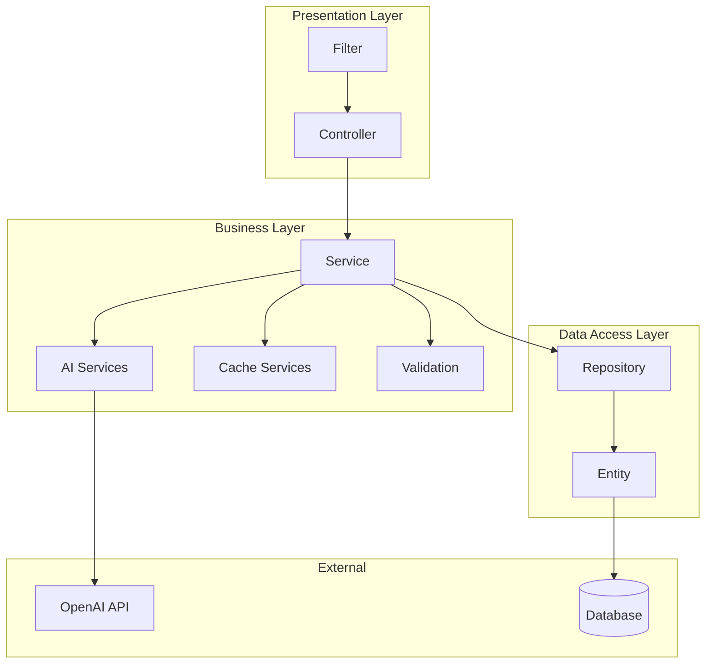
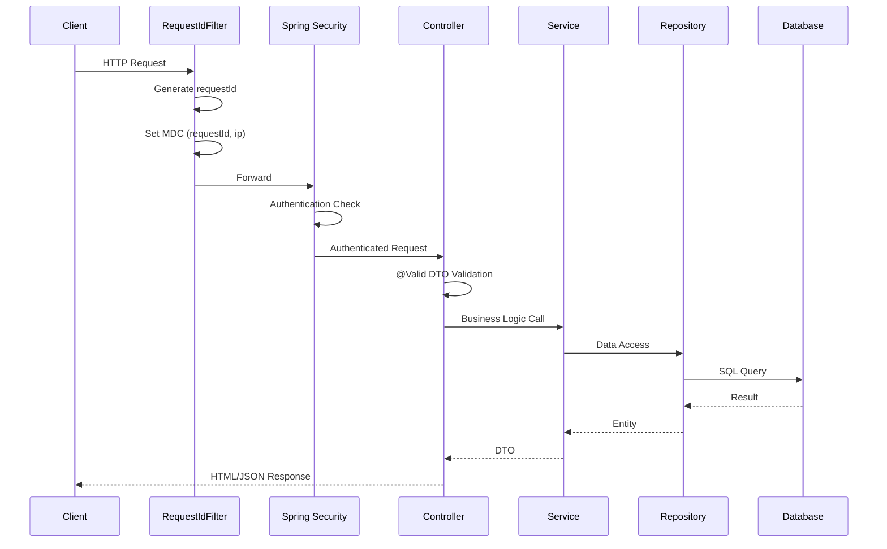
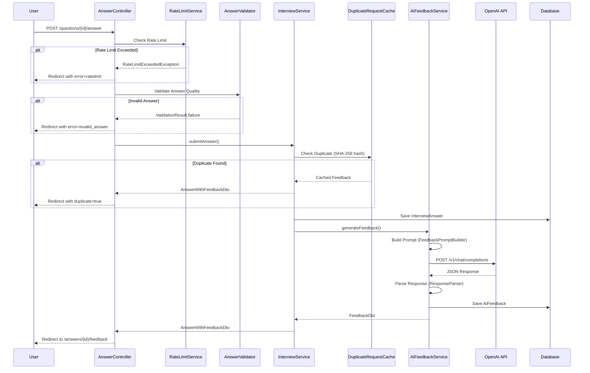
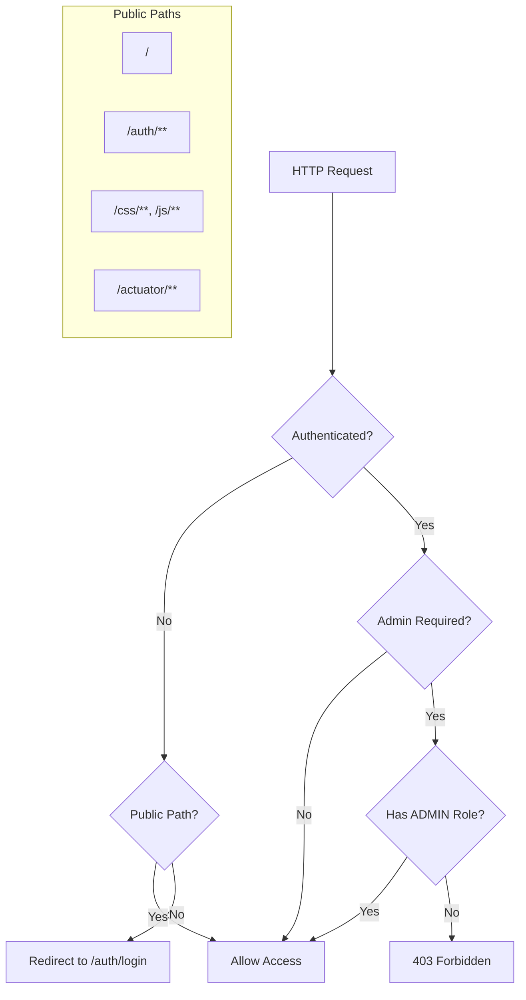
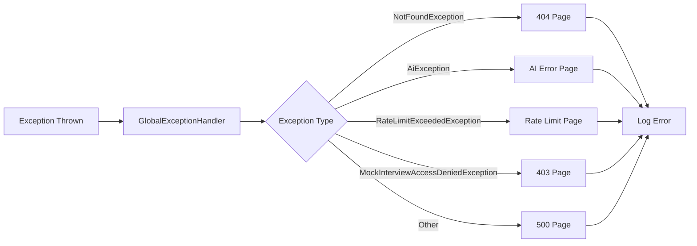
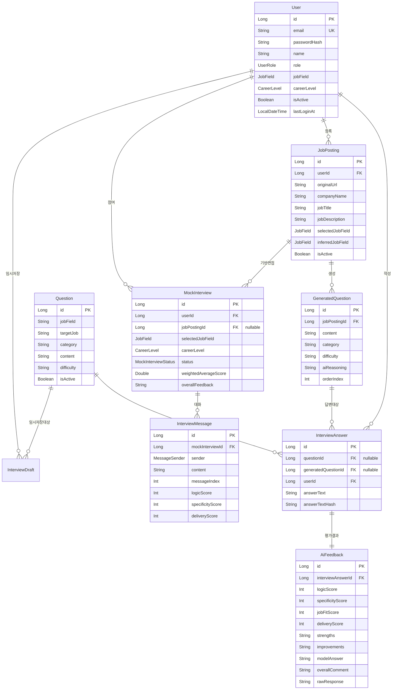
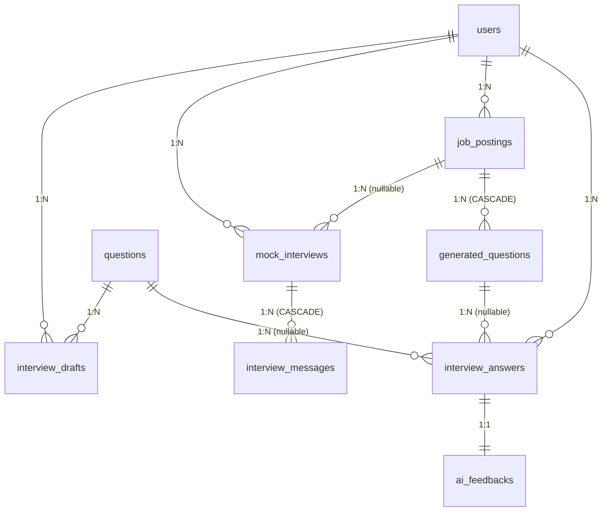

# Interview Note API 프로젝트 분석 문서

> **작성일**: 2026-06-20
> **대상 독자**: 프로젝트를 처음 접하는 백엔드 개발자
> **목적**: 기존 기능 이해, 코드 수정, 신규 API 개발 가이드

---

## 목차

1. [프로젝트 개요](#1-프로젝트-개요)
2. [프로젝트 구조](#2-프로젝트-구조)
3. [실행 흐름](#3-실행-흐름)
4. [도메인 분석](#4-도메인-분석)
5. [API 분석](#5-api-분석)
6. [데이터베이스 분석](#6-데이터베이스-분석)
7. [신규 API 개발 가이드](#7-신규-api-개발-가이드)
8. [수정 시 주의사항](#8-수정-시-주의사항)
9. [개발 환경](#9-개발-환경)
10. [코드 탐색 가이드](#10-코드-탐색-가이드)

---

## 1. 프로젝트 개요

### 1.1 프로젝트 목적

**Interview Note API**는 취업 준비생을 위한 AI 기반 면접 연습 웹 애플리케이션입니다.

사용자가 면접 질문에 텍스트로 답변하면, AI가 평가와 개선 포인트, 모범답변을 제공하고, 사용자는 이를 저장해 리뷰할 수 있습니다.

#### 핵심 가치
- **실사용성**: 실제 면접 준비에 도움이 되는 서비스
- **리뷰 중심**: 단순 질문 은행이 아닌, 답변 개선 과정을 기록
- **백엔드 중심**: 프론트엔드보다 도메인 설계와 AI 연동에 집중

### 1.2 주요 기능

| 기능 | 설명 | Phase |
|------|------|-------|
| **질문 연습** | 17개 직무별 면접 질문 목록 조회 및 답변 작성 | Phase 1 |
| **AI 평가** | OpenAI API를 통한 답변 평가 (논리성, 구체성, 직무적합성, 전달력) | Phase 2 |
| **모범답변 생성** | AI가 생성한 개선된 모범답변 제공 | Phase 2 |
| **리뷰 이력** | 과거 답변 및 평가 내역 조회 | Phase 1 |
| **회원 관리** | 회원가입/로그인, 프로필 설정 (직무, 경력 수준) | Phase 4 |
| **다중 직무 지원** | IT, 영업, 마케팅 등 17개 직무별 맞춤 평가 | Phase 5 |
| **채용공고 기반 질문** | 채용 공고 URL 입력 시 AI가 맞춤 질문 10개 생성 | Phase 6 |
| **AI 모의 면접** | 실시간 채팅 형식의 AI 면접관과 모의 면접 | Phase 7 |

### 1.3 기술 스택

```
┌─────────────────────────────────────────────────────────────┐
│                        Frontend                              │
│  Thymeleaf + Tailwind CSS + HTMX (Server-Side Rendering)    │
└─────────────────────────────────────────────────────────────┘
                              │
┌─────────────────────────────────────────────────────────────┐
│                        Backend                               │
│  Kotlin 2.x + Spring Boot 3.5.14 + Spring Security          │
│  JPA/Hibernate + Flyway + Caffeine Cache                    │
└─────────────────────────────────────────────────────────────┘
                              │
┌─────────────────────────────────────────────────────────────┐
│                       Database                               │
│  H2 (dev) / PostgreSQL 15 (prod)                            │
└─────────────────────────────────────────────────────────────┘
                              │
┌─────────────────────────────────────────────────────────────┐
│                    External Services                         │
│  OpenAI API (gpt-4o-mini)                                   │
└─────────────────────────────────────────────────────────────┘
```

#### 상세 버전 정보

| 구분 | 기술 | 버전 |
|------|------|------|
| 언어 | Kotlin | 2.x (JVM 21) |
| 프레임워크 | Spring Boot | 3.5.14 |
| 빌드 도구 | Gradle | 8.5 (Kotlin DSL) |
| ORM | Hibernate | 6.x |
| DB 마이그레이션 | Flyway | 10.x |
| 캐싱 | Caffeine | 3.1.8 |
| HTTP 파싱 | Jsoup | 1.17.2 |
| 로깅 | Logback + Logstash Encoder | 7.4 |
| 메트릭 | Micrometer + Prometheus | - |

### 1.4 외부 연동 시스템

#### OpenAI API
- **용도**: 답변 평가, 질문 생성, 모의 면접 대화
- **모델**: `gpt-4o-mini`
- **설정 파일**: `application.properties`의 `openai.*` 프로퍼티
- **클라이언트**: `OpenAiClientImpl.kt` (RestTemplate 기반)

```properties
openai.api-key=${OPENAI_API_KEY}
openai.model=gpt-4o-mini
openai.max-tokens=3000
openai.temperature=0.7
openai.timeout=30000
```

#### Jsoup (HTML 파싱)
- **용도**: 채용 공고 URL에서 내용 추출
- **클라이언트**: `JobPostingParserService.kt`
- **Fallback**: 파싱 실패 시 AI가 직접 추론

---

## 2. 프로젝트 구조

### 2.1 패키지 구조

```
src/main/kotlin/com/hojun/interviewnote/interviewnoteapi/
├── config/                 # 설정 클래스
│   ├── AsyncConfig.kt
│   ├── ObjectMapperConfig.kt
│   ├── OpenAiConfig.kt
│   ├── RestTemplateConfig.kt
│   └── SecurityConfig.kt
│
├── controller/             # HTTP 요청 처리
│   ├── AdminController.kt
│   ├── AnswerController.kt
│   ├── AuthController.kt
│   ├── GeneratedQuestionController.kt
│   ├── HomeController.kt
│   ├── JobPostingController.kt
│   ├── MockInterviewController.kt
│   ├── ProfileController.kt
│   ├── QuestionController.kt
│   └── ReviewController.kt
│
├── domain/                 # 엔티티 클래스
│   ├── AiFeedback.kt
│   ├── CareerLevel.kt
│   ├── GeneratedQuestion.kt
│   ├── InterviewAnswer.kt
│   ├── InterviewDraft.kt
│   ├── InterviewMessage.kt
│   ├── JobField.kt
│   ├── JobPosting.kt
│   ├── MockInterview.kt
│   ├── Question.kt
│   ├── User.kt
│   └── UserRole.kt
│
├── dto/                    # 데이터 전송 객체
│   ├── AnswerSubmitDto.kt
│   ├── AnswerWithFeedbackDto.kt
│   ├── FeedbackDto.kt
│   ├── JobPostingDto.kt
│   ├── MockInterviewDto.kt
│   ├── MockInterviewReviewDto.kt
│   ├── QuestionDto.kt
│   ├── ReviewSummaryDto.kt
│   └── UserProfileDto.kt
│
├── exception/              # 예외 처리
│   ├── AiExceptions.kt
│   ├── GlobalExceptionHandler.kt
│   ├── JobPostingExceptions.kt
│   ├── MockInterviewExceptions.kt
│   ├── NotFoundExceptions.kt
│   └── RateLimitExceededException.kt
│
├── filter/                 # HTTP 필터
│   └── RequestIdFilter.kt
│
├── health/                 # 헬스 체크
│   └── OpenAiHealthIndicator.kt
│
├── repository/             # 데이터 접근
│   ├── AiFeedbackRepository.kt
│   ├── GeneratedQuestionRepository.kt
│   ├── InterviewAnswerRepository.kt
│   ├── InterviewDraftRepository.kt
│   ├── InterviewMessageRepository.kt
│   ├── JobPostingRepository.kt
│   ├── MockInterviewRepository.kt
│   ├── QuestionRepository.kt
│   └── UserRepository.kt
│
├── security/               # Spring Security
│   └── CustomUserDetails.kt
│
├── service/                # 비즈니스 로직
│   ├── ai/                 # AI 통합
│   │   ├── AiClient.kt
│   │   ├── InterviewResponseParser.kt
│   │   ├── OpenAiClientImpl.kt
│   │   ├── QuestionResponseParser.kt
│   │   ├── ResponseParser.kt
│   │   └── prompt/
│   │       ├── EvaluationPromptBuilder.kt
│   │       ├── FeedbackPromptBuilder.kt
│   │       ├── InterviewPromptBuilder.kt
│   │       ├── JobFieldPromptConfig.kt
│   │       └── QuestionPromptBuilder.kt
│   ├── cache/              # 캐싱
│   │   ├── DuplicateRequestCache.kt
│   │   └── QuestionCache.kt
│   ├── ratelimit/          # Rate Limiting
│   │   └── RateLimitService.kt
│   ├── validation/         # 검증
│   │   └── AnswerValidator.kt
│   ├── AiFeedbackService.kt
│   ├── CustomUserDetailsService.kt
│   ├── InterviewAiService.kt
│   ├── InterviewService.kt
│   ├── JobPostingParserService.kt
│   ├── JobPostingService.kt
│   ├── MockInterviewService.kt
│   ├── QuestionGeneratorService.kt
│   ├── QuestionService.kt
│   ├── ReviewService.kt
│   ├── SseEmitterService.kt
│   └── UserService.kt
│
└── fixture/                # 테스트 데이터
    └── SampleDataFixture.kt
```

### 2.2 패키지별 역할

| 패키지 | 역할 | 주요 클래스 |
|--------|------|------------|
| `config` | Spring Bean 설정, 외부 설정 로딩 | SecurityConfig, OpenAiConfig |
| `controller` | HTTP 요청 수신, 응답 반환 | AnswerController, MockInterviewController |
| `domain` | JPA 엔티티, Enum 정의 | Question, User, JobField |
| `dto` | 계층 간 데이터 전달 | AnswerSubmitDto, FeedbackDto |
| `exception` | 커스텀 예외, 전역 예외 처리 | AiException, GlobalExceptionHandler |
| `filter` | 요청/응답 전처리 | RequestIdFilter (MDC 설정) |
| `health` | Actuator 헬스 체크 | OpenAiHealthIndicator |
| `repository` | 데이터베이스 접근 (JPA) | QuestionRepository, UserRepository |
| `security` | Spring Security 확장 | CustomUserDetails |
| `service` | 비즈니스 로직 | InterviewService, AiFeedbackService |
| `service/ai` | AI 통합 (OpenAI) | OpenAiClientImpl, PromptBuilder |
| `service/cache` | 캐싱 로직 | DuplicateRequestCache |
| `service/ratelimit` | 요청 제한 | RateLimitService |
| `service/validation` | 입력 검증 | AnswerValidator |

### 2.3 계층 구조 다이어그램



### 2.4 공통 모듈 설명

#### RequestIdFilter
- **위치**: `filter/RequestIdFilter.kt`
- **역할**: 모든 HTTP 요청에 고유 ID 부여, MDC에 저장
- **순서**: `@Order(Ordered.HIGHEST_PRECEDENCE)` - 가장 먼저 실행

```kotlin
// MDC에 저장되는 값
MDC.put("requestId", UUID.randomUUID().toString())
MDC.put("ip", extractClientIp(request))
MDC.put("userId", authentication?.name)
```

#### GlobalExceptionHandler
- **위치**: `exception/GlobalExceptionHandler.kt`
- **역할**: 모든 예외를 가로채어 적절한 에러 페이지 반환
- **어노테이션**: `@ControllerAdvice`

#### ObjectMapperConfig
- **위치**: `config/ObjectMapperConfig.kt`
- **역할**: Jackson ObjectMapper 중앙 관리 (중복 인스턴스 방지)

---

## 3. 실행 흐름

### 3.1 HTTP 요청 처리 흐름



### 3.2 답변 제출 및 AI 평가 흐름



### 3.3 인증/인가 흐름



#### Spring Security 설정 요약

```kotlin
// SecurityConfig.kt
http.authorizeHttpRequests {
    it.requestMatchers("/", "/home", "/error").permitAll()
    it.requestMatchers("/auth/**").permitAll()
    it.requestMatchers("/css/**", "/js/**", "/images/**").permitAll()
    it.requestMatchers("/actuator/**").permitAll()
    it.anyRequest().authenticated()
}
```

### 3.4 예외 처리 흐름



#### 예외 클래스 계층

```
RuntimeException
├── AiException (sealed)
│   ├── AiApiException
│   ├── AiResponseParseException
│   ├── AiRequestException
│   └── AiResponseException
├── NotFoundException (abstract)
│   ├── QuestionNotFoundException
│   ├── AnswerNotFoundException
│   ├── FeedbackNotFoundException
│   └── UserNotFoundException
├── RateLimitExceededException
├── MockInterviewException (sealed)
│   ├── MockInterviewNotFoundException
│   ├── MockInterviewAccessDeniedException
│   ├── MaxTurnExceededException
│   └── InterviewAlreadyEndedException
└── JobPostingException (sealed)
    ├── JobPostingParseException
    ├── JobPostingNotFoundException
    └── JobPostingRateLimitException
```

---

## 4. 도메인 분석

### 4.1 핵심 엔티티 목록

| 엔티티 | 설명 | Phase |
|--------|------|-------|
| `Question` | 정적 면접 질문 (340개 시드 데이터) | Phase 1 |
| `InterviewAnswer` | 사용자 답변 | Phase 1 |
| `AiFeedback` | AI 평가 결과 | Phase 2 |
| `User` | 사용자 계정 | Phase 4 |
| `InterviewDraft` | 답변 임시 저장 | Phase 3 |
| `JobPosting` | 채용 공고 | Phase 6 |
| `GeneratedQuestion` | AI 생성 질문 | Phase 6 |
| `MockInterview` | 모의 면접 세션 | Phase 7 |
| `InterviewMessage` | 모의 면접 메시지 | Phase 7 |

### 4.2 엔티티 관계 다이어그램 (ERD)



### 4.3 엔티티 상세 설명

#### Question (면접 질문)
- **목적**: 시스템에서 제공하는 정적 면접 질문
- **데이터**: Flyway V2, V7 마이그레이션으로 340개+ 시드 데이터
- **필터링**: jobField, category, difficulty로 필터링 가능

```kotlin
@Entity
class Question(
    @Id @GeneratedValue(strategy = GenerationType.IDENTITY)
    val id: Long = 0,
    val jobField: String = "IT",       // 직무 분야
    val targetJob: String,              // 대상 직무명
    val category: String,               // 카테고리 (기술역량, 문제해결 등)
    @Column(columnDefinition = "TEXT")
    val content: String,                // 질문 내용
    val difficulty: String,             // EASY, MEDIUM, HARD
    val isActive: Boolean = true
)
```

#### InterviewAnswer (사용자 답변)
- **목적**: 사용자가 작성한 면접 답변
- **특징**: Question 또는 GeneratedQuestion 중 하나와 연결 (XOR 관계)
- **중복 방지**: answerTextHash (SHA-256)로 동일 답변 감지

```kotlin
@Entity
class InterviewAnswer(
    @Id @GeneratedValue(strategy = GenerationType.IDENTITY)
    val id: Long = 0,
    val questionId: Long? = null,           // 정적 질문 ID (nullable)
    val generatedQuestionId: Long? = null,  // AI 생성 질문 ID (nullable)
    val userId: Long,
    @Column(columnDefinition = "TEXT")
    val answerText: String,
    val answerTextHash: String? = null      // SHA-256 해시
)
```

#### AiFeedback (AI 평가)
- **목적**: AI가 생성한 답변 평가 결과
- **점수**: 4가지 항목 각각 1-5점
- **메타데이터**: 토큰 사용량, 모델명, 프롬프트 버전 저장

```kotlin
@Entity
class AiFeedback(
    @Id @GeneratedValue(strategy = GenerationType.IDENTITY)
    val id: Long = 0,
    val interviewAnswerId: Long,

    // 평가 점수 (1-5)
    val logicScore: Int,         // 논리성
    val specificityScore: Int,   // 구체성
    val jobFitScore: Int,        // 직무 적합성
    val deliveryScore: Int,      // 전달력

    // 피드백 내용 (JSON 배열 문자열)
    @Column(columnDefinition = "TEXT")
    val strengths: String,       // ["강점1", "강점2"]
    @Column(columnDefinition = "TEXT")
    val improvements: String,    // ["개선점1", "개선점2"]
    @Column(columnDefinition = "TEXT")
    val modelAnswer: String,     // AI 모범답변 (400-600자)
    @Column(columnDefinition = "TEXT")
    val overallComment: String,  // 종합 코멘트

    // 메타데이터
    val modelName: String,       // "gpt-4o-mini"
    val promptVersion: String,   // "v1.0"
    val tokenUsageInput: Int,
    val tokenUsageOutput: Int,
    @Column(columnDefinition = "TEXT")
    val rawResponse: String      // 원본 응답 (디버깅용)
) {
    // 계산 프로퍼티
    val averageScore: Double
        get() = (logicScore + specificityScore + jobFitScore + deliveryScore) / 4.0
}
```

### 4.4 Enum 타입

#### JobField (직무 분야) - 17개

```kotlin
enum class JobField(val displayName: String, val code: String) {
    IT("IT/개발", "it"),
    PLANNING("기획", "planning"),
    MARKETING("마케팅", "marketing"),
    ACCOUNTING("회계/재무", "accounting"),
    HR("인사", "hr"),
    ADMIN("총무/행정", "admin"),
    DESIGN("디자인", "design"),
    SALES("영업", "sales"),
    MD("MD/바이어", "md"),
    SERVICE("서비스/고객지원", "service"),
    PRODUCTION("생산/제조", "production"),
    CONSTRUCTION("건설/토목", "construction"),
    MEDICAL("의료/제약", "medical"),
    EDUCATION("교육", "education"),
    MEDIA("미디어/콘텐츠", "media"),
    FINANCE("금융/보험", "finance"),
    PUBLIC("공공/비영리", "public")
}
```

#### CareerLevel (경력 수준) - 4개

```kotlin
enum class CareerLevel(val displayName: String, val code: String) {
    ENTRY("신입", "entry"),
    JUNIOR("주니어 (1-3년)", "junior"),
    SENIOR("미들 (4-7년)", "senior"),
    SENIOR_PLUS("시니어 (8년 이상)", "senior_plus")
}
```

#### UserRole (사용자 역할) - 2개

```kotlin
enum class UserRole {
    USER,   // 일반 사용자
    ADMIN   // 관리자
}
```

### 4.5 주요 비즈니스 규칙

#### Rate Limiting (요청 제한)
| 리소스 | 제한 | 단위 |
|--------|------|------|
| AI 평가 요청 | 33회 | 사용자 / 시간 |
| 채용공고 질문 생성 | 10회 | 사용자 / 24시간 |
| 모의 면접 시작 | 5회 | 사용자 / 24시간 |

#### 중복 방지
- **답변 중복**: SHA-256 해시로 동일 (questionId + answerText) 24시간 캐싱
- **공고 URL**: 동일 URL 7일간 재사용

#### 답변 품질 검증 (AnswerValidator)
1. **반복 문자**: 동일 문자 70% 이상 → 거부
2. **반복 단어**: 동일 단어 40% 이상 → 거부
3. **고유 문자**: 최소 5개 이상 필요
4. **최소 단어**: 10개 이상 필요
5. **의미 있는 문자 비율**: 한글/영어 50% 이상

---

## 5. API 분석

### 5.1 Controller별 엔드포인트 목록

#### AuthController (`/auth`)
| 메서드 | HTTP | 경로 | 인증 | 설명 |
|--------|------|------|------|------|
| loginPage | GET | `/auth/login` | X | 로그인 페이지 |
| registerPage | GET | `/auth/register` | X | 회원가입 페이지 |
| register | POST | `/auth/register-process` | X | 회원가입 처리 |

#### HomeController (`/`)
| 메서드 | HTTP | 경로 | 인증 | 설명 |
|--------|------|------|------|------|
| home | GET | `/`, `/home` | X | 홈페이지 (개인화) |

#### ProfileController (`/profile`)
| 메서드 | HTTP | 경로 | 인증 | 설명 |
|--------|------|------|------|------|
| showProfileSettings | GET | `/profile` | O | 프로필 설정 페이지 |
| updateProfile | POST | `/profile/update` | O | 프로필 업데이트 |

#### QuestionController (`/questions`)
| 메서드 | HTTP | 경로 | 인증 | 설명 |
|--------|------|------|------|------|
| list | GET | `/questions` | X | 질문 목록 |
| listFragment | GET | `/questions/fragment` | X | HTMX용 질문 목록 Fragment |
| answerForm | GET | `/questions/{id}/answer` | X | 답변 작성 폼 |

#### AnswerController (`/answers`, `/questions`)
| 메서드 | HTTP | 경로 | 인증 | 설명 |
|--------|------|------|------|------|
| submitAnswer | POST | `/questions/{questionId}/answer` | O | 답변 제출 + AI 평가 |
| feedback | GET | `/answers/{answerId}/feedback` | O | 평가 결과 페이지 |
| saveDraft | POST | `/questions/{questionId}/draft` | O | 답변 임시 저장 |
| getDraft | GET | `/questions/{questionId}/draft` | O | 임시 저장 불러오기 |

#### ReviewController (`/reviews`)
| 메서드 | HTTP | 경로 | 인증 | 설명 |
|--------|------|------|------|------|
| list | GET | `/reviews` | O | 리뷰 이력 목록 (2개 탭) |
| detail | GET | `/reviews/{answerId}` | O | 리뷰 상세 |

#### JobPostingController (`/job-postings`)
| 메서드 | HTTP | 경로 | 인증 | 설명 |
|--------|------|------|------|------|
| createForm | GET | `/job-postings/create` | O | 공고 등록 폼 |
| create | POST | `/job-postings` | O | 공고 등록 + 질문 생성 |
| questions | GET | `/job-postings/{id}/questions` | O | 생성된 질문 목록 |
| list | GET | `/job-postings` | O | 내 공고 목록 |

#### GeneratedQuestionController (`/generated-questions`)
| 메서드 | HTTP | 경로 | 인증 | 설명 |
|--------|------|------|------|------|
| answerForm | GET | `/generated-questions/{id}/answer` | O | AI 생성 질문 답변 폼 |
| submitAnswer | POST | `/generated-questions/{id}/answer` | O | 답변 제출 |

#### MockInterviewController (`/mock-interviews`)
| 메서드 | HTTP | 경로 | 인증 | 설명 |
|--------|------|------|------|------|
| startInterview | POST | `/mock-interviews/start` | O | 면접 시작 |
| chatPage | GET | `/mock-interviews/{id}/chat` | O | 채팅 페이지 |
| sendMessage | POST | `/mock-interviews/{id}/messages` | O | 메시지 전송 |
| streamMessages | GET | `/mock-interviews/{id}/stream` | O | SSE 스트리밍 |
| endInterview | POST | `/mock-interviews/{id}/end` | O | 면접 종료 |
| resumeInterview | POST | `/mock-interviews/{id}/resume` | O | 면접 재개 |
| resultPage | GET | `/mock-interviews/{id}/result` | O | 결과 페이지 |

#### AdminController (`/api/admin`)
| 메서드 | HTTP | 경로 | 인증 | 권한 | 설명 |
|--------|------|------|------|------|------|
| getJobFieldStats | GET | `/api/admin/stats/job-fields` | O | ADMIN | 직무별 통계 |
| getCareerLevelStats | GET | `/api/admin/stats/career-levels` | O | ADMIN | 경력별 통계 |
| getStatsSummary | GET | `/api/admin/stats/summary` | O | ADMIN | 전체 통계 |

### 5.2 요청/응답 DTO

#### AnswerSubmitDto (답변 제출)
```kotlin
data class AnswerSubmitDto(
    @field:NotNull
    val questionId: Long?,

    @field:NotBlank
    @field:Size(min = 50, max = 2000)
    val answerText: String?
)
```

#### FeedbackDto (평가 응답)
```kotlin
data class FeedbackDto(
    val logicScore: Int,
    val specificityScore: Int,
    val jobFitScore: Int,
    val deliveryScore: Int,
    val strengths: List<String>,
    val improvements: List<String>,
    val modelAnswer: String,
    val overallComment: String,
    val averageScore: Double
) {
    companion object {
        fun from(feedback: AiFeedback): FeedbackDto
    }
}
```

#### RegisterForm (회원가입)
```kotlin
data class RegisterForm(
    @field:Email
    val email: String,

    @field:Size(min = 8, max = 100)
    val password: String,

    @field:NotBlank
    val passwordConfirm: String,

    @field:Size(min = 2, max = 50)
    val name: String
)
```

#### UpdateProfileRequest (프로필 수정)
```kotlin
data class UpdateProfileRequest(
    @field:NotBlank
    @field:Size(min = 2, max = 50)
    val name: String,

    @field:NotNull
    val jobField: JobField?,

    @field:NotNull
    val careerLevel: CareerLevel?
)
```

### 5.3 검증 규칙 요약

| DTO | 필드 | 검증 규칙 |
|-----|------|---------|
| AnswerSubmitDto | answerText | 50-2000자, 빈 문자열 불가 |
| RegisterForm | email | 이메일 형식 |
| RegisterForm | password | 8-100자 |
| RegisterForm | name | 2-50자 |
| UpdateProfileRequest | name | 2-50자 |
| UpdateProfileRequest | jobField | 필수 (17개 중 선택) |
| UpdateProfileRequest | careerLevel | 필수 (4개 중 선택) |

### 5.4 에러 응답 형식

#### HTML 리다이렉트 (Thymeleaf)
```
/questions/{id}/answer?error=ratelimit
/questions/{id}/answer?error=invalid_answer
/questions/{id}/answer?warning=low_quality
/answers/{id}/feedback?duplicate=true
```

#### JSON 응답 (MockInterviewController)
```json
{
  "success": false,
  "error": "면접이 이미 종료되었습니다",
  "detail": "상세 설명",
  "errorType": "INTERVIEW_ENDED"
}
```

---

## 6. 데이터베이스 분석

### 6.1 테이블 목록

| 테이블명 | 엔티티 | 설명 |
|----------|--------|------|
| `users` | User | 사용자 계정 |
| `questions` | Question | 정적 면접 질문 |
| `interview_answers` | InterviewAnswer | 사용자 답변 |
| `ai_feedbacks` | AiFeedback | AI 평가 결과 |
| `interview_drafts` | InterviewDraft | 답변 임시 저장 |
| `job_postings` | JobPosting | 채용 공고 |
| `generated_questions` | GeneratedQuestion | AI 생성 질문 |
| `mock_interviews` | MockInterview | 모의 면접 세션 |
| `interview_messages` | InterviewMessage | 모의 면접 메시지 |

### 6.2 테이블 관계 다이어그램



### 6.3 인덱스 전략

#### 기본 인덱스 (Phase 1-2)
```sql
-- 질문 필터링
CREATE INDEX idx_questions_category ON questions(category);
CREATE INDEX idx_questions_difficulty ON questions(difficulty);
CREATE INDEX idx_questions_active ON questions(is_active);
CREATE INDEX idx_questions_job_field ON questions(job_field);

-- 답변 조회
CREATE INDEX idx_interview_answers_question ON interview_answers(question_id);
CREATE INDEX idx_interview_answers_created ON interview_answers(created_at);

-- 피드백 조회
CREATE INDEX idx_ai_feedbacks_answer ON ai_feedbacks(interview_answer_id);
CREATE INDEX idx_ai_feedbacks_hash_created ON ai_feedbacks(answer_text_hash, created_at);
```

#### 사용자 관련 인덱스 (Phase 4-5)
```sql
-- 로그인 최적화
CREATE INDEX idx_users_email ON users(email);
CREATE INDEX idx_users_active_email ON users(is_active, email);

-- 사용자별 데이터 조회
CREATE INDEX idx_interview_answers_user_id ON interview_answers(user_id);
CREATE INDEX idx_interview_answers_user_created ON interview_answers(user_id, created_at DESC);

-- 직무 필터링
CREATE INDEX idx_users_job_field ON users(job_field);
```

#### 채용공고/생성질문 인덱스 (Phase 6)
```sql
CREATE INDEX idx_job_postings_user ON job_postings(user_id);
CREATE INDEX idx_job_postings_active ON job_postings(is_active);
CREATE INDEX idx_generated_questions_posting ON generated_questions(job_posting_id);
CREATE INDEX idx_generated_questions_order ON generated_questions(job_posting_id, order_index);
```

#### 모의 면접 인덱스 (Phase 7-8)
```sql
CREATE INDEX idx_mock_interviews_user_id ON mock_interviews(user_id);
CREATE INDEX idx_mock_interviews_status ON mock_interviews(status);
CREATE INDEX idx_interview_messages_order ON interview_messages(mock_interview_id, message_index);
```

### 6.4 Flyway 마이그레이션 히스토리

| 버전 | 파일명 | 설명 | Phase |
|------|--------|------|-------|
| V1 | Create_tables.sql | 기본 테이블 생성 | 1-2 |
| V2 | Insert_questions.sql | 질문 시드 데이터 (IT) | 1 |
| V3 | Add_answer_text_hash.sql | ai_feedbacks에 해시 추가 | 2B |
| V4 | Create_users_table.sql | users 테이블 생성 | 4A |
| V5 | Add_user_id_to_answers.sql | 답변에 user_id 추가 | 4B |
| V6 | Add_job_field_career_level.sql | 직무/경력 필드 추가 | 5A |
| V7 | Insert_multi_job_questions.sql | 17개 직무 질문 추가 | 5A |
| V8 | Create_interview_drafts.sql | 임시저장 테이블 | 3 |
| V9 | Create_job_postings_tables.sql | 채용공고/생성질문 테이블 | 6A |
| V10 | Add_generated_question_id.sql | 답변에 생성질문ID 추가 | 6C |
| V11 | Make_question_id_nullable.sql | question_id nullable | 6E |
| V12 | Create_mock_interview_tables.sql | 모의면접 테이블 | 7 |
| V13 | Add_mock_interview_scoring.sql | 점수 계산 필드 추가 | 8A |
| V14 | Add_answer_text_hash_to_answers.sql | 답변에 해시 추가 | - |

### 6.5 데이터 저장 흐름

#### 답변 제출 시 데이터 저장 순서
```
1. interview_answers INSERT
   └─ question_id, user_id, answer_text, answer_text_hash, created_at

2. ai_feedbacks INSERT (AI 평가 후)
   └─ interview_answer_id, scores, feedback, metadata
```

#### 모의 면접 시 데이터 저장 순서
```
1. mock_interviews INSERT (시작 시)
   └─ user_id, job_posting_id, selected_job_field, status='IN_PROGRESS'

2. interview_messages INSERT (각 메시지마다)
   └─ mock_interview_id, sender, content, message_index

3. mock_interviews UPDATE (종료 시)
   └─ status='COMPLETED', overall_feedback, weighted_average_score
```

---

## 7. 신규 API 개발 가이드

### 7.1 새로운 API 추가 시 파일 생성 위치

```
신규 기능 "BookmarkService" 추가 예시:

1. 엔티티 (필요 시)
   src/main/kotlin/.../domain/Bookmark.kt

2. Repository
   src/main/kotlin/.../repository/BookmarkRepository.kt

3. Service
   src/main/kotlin/.../service/BookmarkService.kt

4. DTO
   src/main/kotlin/.../dto/BookmarkDto.kt

5. Controller
   src/main/kotlin/.../controller/BookmarkController.kt

6. 예외 (필요 시)
   src/main/kotlin/.../exception/BookmarkExceptions.kt

7. 마이그레이션 (테이블 추가 시)
   src/main/resources/db/migration/V15__Create_bookmarks_table.sql
```

### 7.2 Controller 작성 패턴

```kotlin
@Controller
@RequestMapping("/bookmarks")
class BookmarkController(
    private val bookmarkService: BookmarkService,
    private val questionService: QuestionService
) {
    // 1. 목록 조회 (GET)
    @GetMapping
    fun list(
        @AuthenticationPrincipal userDetails: CustomUserDetails,
        model: Model
    ): String {
        val userId = userDetails.getUserId()
        val bookmarks = bookmarkService.findByUserId(userId)
        model.addAttribute("bookmarks", bookmarks)
        return "bookmarks/list"
    }

    // 2. 상세 조회 (GET)
    @GetMapping("/{id}")
    fun detail(
        @PathVariable id: Long,
        @AuthenticationPrincipal userDetails: CustomUserDetails,
        model: Model
    ): String {
        val userId = userDetails.getUserId()
        val bookmark = bookmarkService.findByIdAndUserId(id, userId)
            ?: throw BookmarkNotFoundException(id)
        model.addAttribute("bookmark", bookmark)
        return "bookmarks/detail"
    }

    // 3. 생성 (POST)
    @PostMapping
    fun create(
        @Valid @ModelAttribute request: CreateBookmarkRequest,
        @AuthenticationPrincipal userDetails: CustomUserDetails,
        redirectAttributes: RedirectAttributes
    ): String {
        val userId = userDetails.getUserId()
        val bookmark = bookmarkService.create(userId, request)
        redirectAttributes.addFlashAttribute("message", "북마크가 추가되었습니다")
        return "redirect:/bookmarks/${bookmark.id}"
    }

    // 4. 삭제 (POST or DELETE)
    @PostMapping("/{id}/delete")
    fun delete(
        @PathVariable id: Long,
        @AuthenticationPrincipal userDetails: CustomUserDetails
    ): String {
        val userId = userDetails.getUserId()
        bookmarkService.delete(id, userId)
        return "redirect:/bookmarks"
    }
}
```

### 7.3 Service 작성 패턴

```kotlin
@Service
@Transactional(readOnly = true)  // 기본은 읽기 전용
class BookmarkService(
    private val bookmarkRepository: BookmarkRepository,
    private val questionRepository: QuestionRepository
) {
    // 조회 메서드 (readOnly = true)
    fun findByUserId(userId: Long): List<BookmarkDto> {
        return bookmarkRepository.findByUserId(userId)
            .map { BookmarkDto.from(it) }
    }

    fun findByIdAndUserId(id: Long, userId: Long): BookmarkDto? {
        return bookmarkRepository.findByIdAndUserId(id, userId)
            ?.let { BookmarkDto.from(it) }
    }

    // 생성/수정/삭제 메서드 (readOnly = false)
    @Transactional
    fun create(userId: Long, request: CreateBookmarkRequest): BookmarkDto {
        // 1. 비즈니스 검증
        val question = questionRepository.findById(request.questionId)
            .orElseThrow { QuestionNotFoundException(request.questionId) }

        // 2. 중복 체크
        if (bookmarkRepository.existsByUserIdAndQuestionId(userId, request.questionId)) {
            throw BookmarkAlreadyExistsException(userId, request.questionId)
        }

        // 3. 엔티티 생성 및 저장
        val bookmark = Bookmark(
            userId = userId,
            questionId = question.id
        )
        val saved = bookmarkRepository.save(bookmark)

        return BookmarkDto.from(saved)
    }

    @Transactional
    fun delete(id: Long, userId: Long) {
        val bookmark = bookmarkRepository.findByIdAndUserId(id, userId)
            ?: throw BookmarkNotFoundException(id)
        bookmarkRepository.delete(bookmark)
    }
}
```

### 7.4 Repository 작성 패턴

```kotlin
interface BookmarkRepository : JpaRepository<Bookmark, Long> {
    // 사용자별 조회 (보안)
    fun findByUserId(userId: Long): List<Bookmark>

    fun findByIdAndUserId(id: Long, userId: Long): Bookmark?

    // 중복 체크
    fun existsByUserIdAndQuestionId(userId: Long, questionId: Long): Boolean

    // 페이지네이션
    fun findByUserIdOrderByCreatedAtDesc(
        userId: Long,
        pageable: Pageable
    ): Page<Bookmark>

    // 커스텀 쿼리 (필요 시)
    @Query("""
        SELECT b FROM Bookmark b
        JOIN FETCH b.question q
        WHERE b.userId = :userId AND q.isActive = true
    """)
    fun findActiveBookmarksByUserId(@Param("userId") userId: Long): List<Bookmark>
}
```

### 7.5 DTO 작성 규칙

```kotlin
// 1. 응답 DTO - companion object에 from() 팩토리 메서드
data class BookmarkDto(
    val id: Long,
    val questionId: Long,
    val questionContent: String,
    val createdAt: LocalDateTime
) {
    companion object {
        fun from(bookmark: Bookmark, question: Question): BookmarkDto {
            return BookmarkDto(
                id = bookmark.id,
                questionId = bookmark.questionId,
                questionContent = question.content,
                createdAt = bookmark.createdAt
            )
        }
    }
}

// 2. 요청 DTO - Bean Validation 어노테이션
data class CreateBookmarkRequest(
    @field:NotNull(message = "질문 ID는 필수입니다")
    val questionId: Long?
)

// 3. 수정 요청 DTO
data class UpdateBookmarkRequest(
    @field:Size(max = 500, message = "메모는 500자 이내로 작성해주세요")
    val memo: String?
)
```

### 7.6 Validation 규칙

```kotlin
// Bean Validation 어노테이션 사용
data class SomeRequest(
    @field:NotNull                    // null 불가
    @field:NotBlank                   // null, "", " " 불가
    @field:Size(min = 1, max = 100)   // 길이 제한
    @field:Email                      // 이메일 형식
    @field:Pattern(regexp = "...")    // 정규식 검증
    val field: String?
)

// Controller에서 @Valid 사용
@PostMapping
fun create(@Valid @ModelAttribute request: SomeRequest)
```

### 7.7 예외 처리 패턴

```kotlin
// 1. 커스텀 예외 정의
sealed class BookmarkException(message: String) : RuntimeException(message)

class BookmarkNotFoundException(id: Long) :
    BookmarkException("북마크를 찾을 수 없습니다: $id")

class BookmarkAlreadyExistsException(userId: Long, questionId: Long) :
    BookmarkException("이미 북마크된 질문입니다")

// 2. GlobalExceptionHandler에 핸들러 추가
@ControllerAdvice
class GlobalExceptionHandler {

    @ExceptionHandler(BookmarkNotFoundException::class)
    fun handleBookmarkNotFound(ex: BookmarkNotFoundException): String {
        logger.error("Bookmark not found: ${ex.message}")
        return "error/404"
    }

    @ExceptionHandler(BookmarkAlreadyExistsException::class)
    fun handleBookmarkExists(
        ex: BookmarkAlreadyExistsException,
        redirectAttributes: RedirectAttributes
    ): String {
        redirectAttributes.addFlashAttribute("error", ex.message)
        return "redirect:/bookmarks"
    }
}
```

---

## 8. 수정 시 주의사항

### 8.1 변경 영향도가 큰 영역

#### 1. SecurityConfig.kt
- **영향**: 모든 인증/인가 동작
- **주의**: permitAll() 경로 추가/제거 시 테스트 필수
- **위치**: `config/SecurityConfig.kt`

```kotlin
// 새 경로 공개 시
.requestMatchers("/new-public/**").permitAll()

// 관리자 전용 경로 추가 시
.requestMatchers("/admin/**").hasRole("ADMIN")
```

#### 2. OpenAiClientImpl.kt
- **영향**: 모든 AI 기능 (평가, 질문 생성, 면접)
- **주의**: API 호출 형식 변경 시 Fallback 테스트 필수
- **위치**: `service/ai/OpenAiClientImpl.kt`

#### 3. PromptBuilder 클래스들
- **영향**: AI 응답 품질
- **주의**: 프롬프트 변경 시 promptVersion 업데이트
- **위치**: `service/ai/prompt/`

#### 4. GlobalExceptionHandler.kt
- **영향**: 모든 에러 페이지 렌더링
- **주의**: 새 예외 타입 추가 시 핸들러 등록 필요
- **위치**: `exception/GlobalExceptionHandler.kt`

### 8.2 공통 로직 위치

| 로직 | 클래스 | 위치 |
|------|--------|------|
| 답변 품질 검증 | AnswerValidator | `service/validation/` |
| Rate Limit 체크 | RateLimitService | `service/ratelimit/` |
| 중복 요청 캐싱 | DuplicateRequestCache | `service/cache/` |
| 사용자 ID 추출 | CustomUserDetails | `security/` |
| 요청 ID 설정 | RequestIdFilter | `filter/` |
| JSON 파싱 | ObjectMapperConfig | `config/` |

### 8.3 트랜잭션 처리 방식

```kotlin
@Service
@Transactional(readOnly = true)  // 클래스 레벨: 기본 읽기 전용
class SomeService {

    // 읽기 전용 (클래스 기본값 적용)
    fun findById(id: Long): Entity?

    // 쓰기 작업 (명시적 @Transactional)
    @Transactional
    fun create(request: CreateRequest): Entity

    // 여러 저장소 접근 (하나의 트랜잭션)
    @Transactional
    fun complexOperation() {
        repository1.save(entity1)
        repository2.save(entity2)  // 롤백 시 entity1도 롤백
    }
}
```

#### 주의사항
- **@Transactional 누락**: 여러 저장소 접근 시 반드시 명시
- **readOnly=true**: SELECT만 수행하는 메서드에 권장 (성능 향상)
- **예외 발생 시**: RuntimeException은 자동 롤백, Checked Exception은 롤백 안 됨

### 8.4 N+1 쿼리 방지 패턴

#### 문제 상황
```kotlin
// BAD: N+1 발생
fun getReviews(userId: Long): List<ReviewDto> {
    val answers = answerRepository.findByUserId(userId)  // 1회 쿼리
    return answers.map { answer ->
        val feedback = feedbackRepository.findByAnswerId(answer.id)  // N회 쿼리
        ReviewDto(answer, feedback)
    }
}
```

#### 해결 방법 1: 배치 조회
```kotlin
// GOOD: 2회 쿼리로 해결
fun getReviews(userId: Long): List<ReviewDto> {
    val answers = answerRepository.findByUserId(userId)
    val answerIds = answers.map { it.id }

    // 배치 조회
    val feedbacks = feedbackRepository.findAllByAnswerIdIn(answerIds)
    val feedbackMap = feedbacks.associateBy { it.answerId }

    return answers.map { answer ->
        ReviewDto(answer, feedbackMap[answer.id])
    }
}
```

#### 해결 방법 2: FETCH JOIN
```kotlin
// Repository에 JOIN FETCH 쿼리 추가
@Query("""
    SELECT a FROM InterviewAnswer a
    JOIN FETCH a.feedback
    WHERE a.userId = :userId
""")
fun findByUserIdWithFeedback(@Param("userId") userId: Long): List<InterviewAnswer>
```

### 8.5 성능 관련 주의사항

#### 캐싱 활용
```kotlin
// DuplicateRequestCache 사용 예시
@Autowired
private lateinit var cache: DuplicateRequestCache

fun someExpensiveOperation(key: String): Result {
    // 캐시 확인
    cache.get(key)?.let { return it }

    // 캐시 미스 시 실행
    val result = expensiveComputation()
    cache.put(key, result)
    return result
}
```

#### 페이지네이션 필수
```kotlin
// BAD: 모든 데이터 로딩
fun findAll(): List<Entity>

// GOOD: 페이지네이션
fun findAll(pageable: Pageable): Page<Entity>
```

---

## 9. 개발 환경

### 9.1 프로젝트 실행 방법

#### Gradle 직접 실행 (개발)
```bash
# 환경 변수 설정
export OPENAI_API_KEY=sk-...

# 개발 프로파일로 실행
./gradlew bootRun --args='--spring.profiles.active=dev'
```

#### Docker Compose 실행 (프로덕션)
```bash
# .env 파일 생성
cp .env.example .env
# OPENAI_API_KEY 설정

# 컨테이너 빌드 및 실행
docker-compose up --build

# 백그라운드 실행
docker-compose up -d
```

### 9.2 환경 변수

| 변수명 | 필수 | 설명 | 기본값 |
|--------|------|------|--------|
| `OPENAI_API_KEY` | O | OpenAI API 키 | - |
| `SPRING_PROFILES_ACTIVE` | X | 활성 프로파일 | dev |
| `SPRING_DATASOURCE_URL` | X (prod) | DB 연결 URL | - |
| `SPRING_DATASOURCE_USERNAME` | X (prod) | DB 사용자명 | - |
| `SPRING_DATASOURCE_PASSWORD` | X (prod) | DB 비밀번호 | - |

### 9.3 프로파일 구성

#### dev 프로파일 (개발)
- **데이터베이스**: H2 인메모리
- **로깅**: DEBUG 레벨
- **SQL 출력**: 활성화
- **H2 Console**: `/h2-console` 접근 가능

```properties
# application-dev.properties
spring.datasource.url=jdbc:h2:mem:interviewdb
spring.jpa.show-sql=true
logging.level.com.hojun.interviewnote=DEBUG
```

#### prod 프로파일 (프로덕션)
- **데이터베이스**: PostgreSQL
- **로깅**: INFO 레벨, JSON 형식
- **커넥션 풀**: HikariCP (10개)
- **헬스 체크**: 활성화

```properties
# application-prod.properties
spring.datasource.url=${SPRING_DATASOURCE_URL}
spring.jpa.show-sql=false
logging.level.com.hojun.interviewnote=INFO
```

### 9.4 빌드 및 배포 방식

#### 빌드
```bash
# 테스트 포함 빌드
./gradlew build

# 테스트 제외 빌드
./gradlew build -x test

# JAR 파일 위치
build/libs/interview-note-api-*.jar
```

#### Docker 이미지 빌드
```bash
# 멀티 스테이지 빌드 (~180MB)
docker build -t interview-note-api .

# 태그 지정
docker build -t interview-note-api:1.0.0 .
```

#### 배포 (Docker Compose)
```bash
# 서비스 시작
docker-compose up -d

# 로그 확인
docker-compose logs -f app

# 서비스 중지
docker-compose down

# 볼륨 포함 삭제
docker-compose down -v
```

### 9.5 테스트 실행

```bash
# 전체 테스트
./gradlew test

# 특정 테스트 클래스
./gradlew test --tests "InterviewServiceTest"

# 테스트 리포트
open build/reports/tests/test/index.html
```

---

## 10. 코드 탐색 가이드

### 10.1 예시: 사용자 답변 제출 흐름 추적

사용자가 답변을 제출하고 AI 평가를 받는 전체 흐름을 추적합니다.

#### Step 1: HTTP 요청 수신
```
파일: controller/AnswerController.kt
메서드: submitAnswer()
경로: POST /questions/{questionId}/answer
```

```kotlin
@PostMapping("/questions/{questionId}/answer")
fun submitAnswer(
    @PathVariable questionId: Long,
    @Valid @ModelAttribute answerSubmit: AnswerSubmitDto,
    @AuthenticationPrincipal userDetails: CustomUserDetails
): String {
    // 1. 사용자 ID 추출
    val userId = userDetails.getUserId()

    // 2. Rate Limit 체크
    if (!rateLimitService.isAllowed(userId)) {
        return buildRedirectWithError(...)
    }

    // 3. 답변 품질 검증
    val validationResult = answerValidator.validate(answerSubmit.answerText!!)
    if (!validationResult.isValid) {
        return buildRedirectWithError(...)
    }

    // 4. 서비스 호출
    val result = interviewService.submitAnswer(userId, questionId, answerSubmit.answerText!!)

    // 5. 리다이렉트
    return "redirect:/answers/${result.answerId}/feedback"
}
```

#### Step 2: 비즈니스 로직 실행
```
파일: service/InterviewService.kt
메서드: submitAnswer()
```

```kotlin
@Transactional
fun submitAnswer(userId: Long, questionId: Long, answerText: String): AnswerWithFeedbackDto {
    // 1. 질문 존재 확인
    val question = questionService.findById(questionId)
        ?: throw QuestionNotFoundException(questionId)

    // 2. 답변 저장
    val hash = generateHash(questionId.toString() + answerText)
    val answer = InterviewAnswer(
        questionId = questionId,
        userId = userId,
        answerText = answerText,
        answerTextHash = hash
    )
    val savedAnswer = answerRepository.save(answer)

    // 3. AI 평가 생성
    val feedback = aiFeedbackService.generateFeedback(
        question = question,
        answer = savedAnswer
    )

    return AnswerWithFeedbackDto.from(savedAnswer, question, feedback)
}
```

#### Step 3: AI 평가 생성
```
파일: service/AiFeedbackService.kt
메서드: generateFeedback()
```

```kotlin
@Transactional
fun generateFeedback(question: QuestionDto, answer: InterviewAnswer): FeedbackDto {
    // 1. 캐시 확인
    val cacheKey = answer.answerTextHash ?: return generateAndSave(question, answer)
    duplicateRequestCache.get(cacheKey)?.let {
        return copyAndSaveCachedFeedback(it, answer)
    }

    // 2. 프롬프트 생성
    val systemPrompt = feedbackPromptBuilder.buildSystemPrompt(question.jobField)
    val userPrompt = feedbackPromptBuilder.buildUserPrompt(question.content, answer.answerText)

    // 3. AI 호출
    val response = aiClient.chat(systemPrompt, userPrompt)

    // 4. 응답 파싱
    val parsed = responseParser.parse(response)

    // 5. 피드백 저장
    val feedback = AiFeedback(
        interviewAnswerId = answer.id,
        logicScore = parsed.scores.logic,
        // ... 기타 필드
    )
    val saved = feedbackRepository.save(feedback)

    // 6. 캐시 저장
    duplicateRequestCache.put(cacheKey, saved)

    return FeedbackDto.from(saved)
}
```

#### Step 4: OpenAI API 호출
```
파일: service/ai/OpenAiClientImpl.kt
메서드: chat()
```

```kotlin
override fun chat(systemPrompt: String, userPrompt: String): String {
    val request = mapOf(
        "model" to config.model,
        "messages" to listOf(
            mapOf("role" to "system", "content" to systemPrompt),
            mapOf("role" to "user", "content" to userPrompt)
        ),
        "max_tokens" to config.maxTokens,
        "temperature" to config.temperature,
        "response_format" to mapOf("type" to "json_object")
    )

    val response = restTemplate.postForObject(
        "https://api.openai.com/v1/chat/completions",
        request,
        OpenAiResponse::class.java
    )

    return response?.choices?.firstOrNull()?.message?.content
        ?: throw AiResponseException("Empty response")
}
```

### 10.2 주요 기능별 진입점

| 기능 | Controller | Service | 진입 메서드 |
|------|------------|---------|------------|
| 회원가입 | AuthController | UserService | register() |
| 로그인 | Spring Security | CustomUserDetailsService | loadUserByUsername() |
| 질문 목록 | QuestionController | QuestionService | findAll() |
| 답변 제출 | AnswerController | InterviewService | submitAnswer() |
| 리뷰 이력 | ReviewController | ReviewService | getUserReviews() |
| 공고 등록 | JobPostingController | JobPostingService | createJobPosting() |
| 질문 생성 | JobPostingService | QuestionGeneratorService | generateQuestions() |
| 면접 시작 | MockInterviewController | MockInterviewService | startInterview() |
| 면접 대화 | MockInterviewController | InterviewAiService | generateFollowUpQuestion() |

### 10.3 처음 읽어야 하는 클래스 추천

#### 1순위: 핵심 도메인 이해
1. `domain/Question.kt` - 면접 질문 구조
2. `domain/InterviewAnswer.kt` - 사용자 답변 구조
3. `domain/AiFeedback.kt` - AI 평가 결과 구조

#### 2순위: 비즈니스 로직 이해
4. `service/InterviewService.kt` - 답변 제출 흐름
5. `service/AiFeedbackService.kt` - AI 평가 생성
6. `service/ai/OpenAiClientImpl.kt` - AI API 호출

#### 3순위: 요청 처리 이해
7. `controller/AnswerController.kt` - 답변 관련 엔드포인트
8. `controller/QuestionController.kt` - 질문 관련 엔드포인트
9. `config/SecurityConfig.kt` - 인증/인가 설정

#### 4순위: 공통 기능 이해
10. `service/validation/AnswerValidator.kt` - 답변 품질 검증
11. `service/ratelimit/RateLimitService.kt` - Rate Limiting
12. `exception/GlobalExceptionHandler.kt` - 예외 처리

---

## 부록: 용어 사전

| 용어 | 설명 |
|------|------|
| Phase | 개발 단계 (Phase 1: 기반 구축, Phase 2: AI 연동, ...) |
| JobField | 직무 분야 (IT, 영업, 마케팅 등 17개) |
| CareerLevel | 경력 수준 (신입, 주니어, 미들, 시니어) |
| AiFeedback | AI가 생성한 답변 평가 결과 |
| MockInterview | AI 면접관과의 모의 면접 세션 |
| GeneratedQuestion | 채용 공고 기반 AI 생성 질문 |
| Rate Limit | 요청 제한 (시간당 최대 요청 수) |
| SSE | Server-Sent Events (실시간 스트리밍) |
| MDC | Mapped Diagnostic Context (로깅 컨텍스트) |

---

## 변경 이력

| 날짜 | 버전 | 변경 내용 |
|------|------|---------|
| 2026-06-20 | 1.0.0 | 최초 작성 |

---

> **문서 작성**: Claude Code
> **최종 검토**: -
> **피드백**: GitHub Issues 또는 PR로 제출
